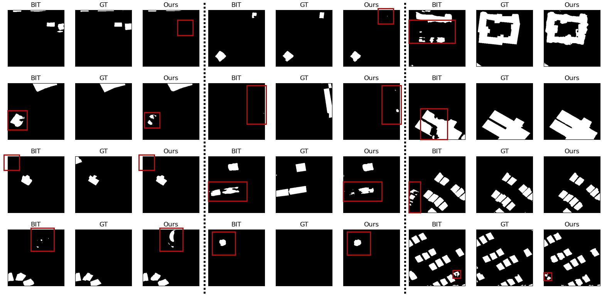
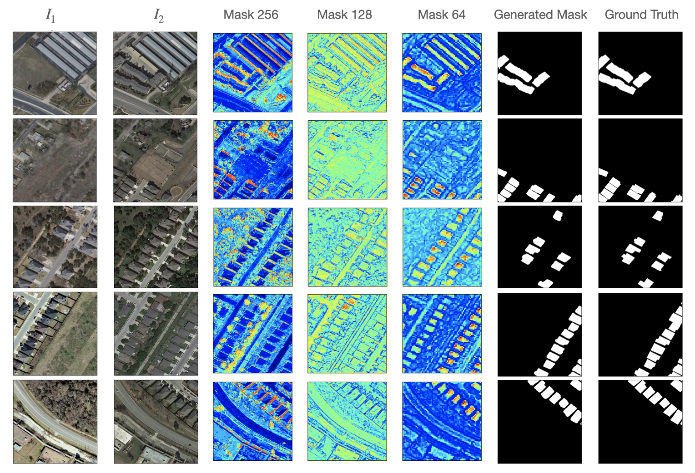

# Tiny_CD

This is the implementation of: TinyCD: A (Not So) Deep Learning Model For Change Detection

:fire: :fire: :fire: TinyCD has been accepted for publication in Neural Computing and Applications https://link.springer.com/article/10.1007/s00521-022-08122-3 :fire: :fire: :fire:

You can find the pre-print version here: https://arxiv.org/abs/2207.13159


## Results


https://user-images.githubusercontent.com/54067932/180251485-b3776855-3666-460a-a15b-05b2bbc0a088.mp4


In the following table we report the quantitative comparison of our model and other State-of-the-art models. F1 scores are reported in percentage, parameters in Millions and Flops in Gigaflops


Here we report a visual comparison between the mask generated by TinyCD and BIT.
We selected negative samples in the fairness way in order to show both similarities and differences between the obtained results.


Finally, we show a complete sequence of intermediate masks and final binary classification mask to show the ability of our tiny model in detecting detailed objects.



## Installation and Requirements

The easiest way to reproduce our results is to create a folder named "TinyCD" on your device and then
clone this repository in "TinyCD":

```shell
git clone https://github.com/AndreaCodegoni/Tiny_model_4_CD.git
```

Then, you can create a virtual ``conda`` environment named ``TinyCD`` with the following cmd:

```shell
conda create --name TinyCD --file requirements.txt
conda activate TinyCD
```

## Dataset 

You can find the original datasets at these two links:

LEVIR-CD: https://justchenhao.github.io/LEVIR/

WHU-CD: https://study.rsgis.whu.edu.cn/pages/download/building_dataset.html

Then, for each dataset, you have to organise the data in the following way:

`A`: images of t1 phase;

`B`: images of t2 phase;

`label`: label maps;

`list`: contains `train.txt`, `val.txt` and `test.txt`, each file records the image names (XXX.png) in the change detection dataset.

If you prefer, you can download the pre-processed dataset using the following:

LEVIR-CD 
```cmd
wget https://www.dropbox.com/s/h9jl2ygznsaeg5d/LEVIR-CD-256.zip
```
WHU-CD
```cmd
wget https://www.dropbox.com/s/r76a00jcxp5d3hl/WHU-CD-256.zip
```

If you have any trouble with the datasets, feel free to contact us.


## Evaluate pretrained models

If you want to evaluate your trained model, or if you want to reproduce the paper results with the pretrained models that 
you can find in the "pretrained_models" folder, you can run:

```cmd
python test_ondata.py --datapath "Your_data_path" --modelpath "Your_path_to_pretrained_model"
```

## Train your model

You can re-train our model, or if you prefer you can play with the parameters of our model and then train it using 

```cmd
python training.py --datapath "Your_data_path" --log-path "Path_to_save_logs_and_models_checkpoints"
```

## References

We want to mention the following repositories that greatly help us in our work:

- https://github.com/justchenhao/BIT_CD We have used this repository in the visual comparison and to report other state-of-the-art results on the two datasets.
- https://github.com/wgcban/ChangeFormer/ and https://github.com/wgcban/SemiCD for the datasets.

## License
Code is released for non-commercial and research purposes **only**. For commercial purposes, please contact the authors.
